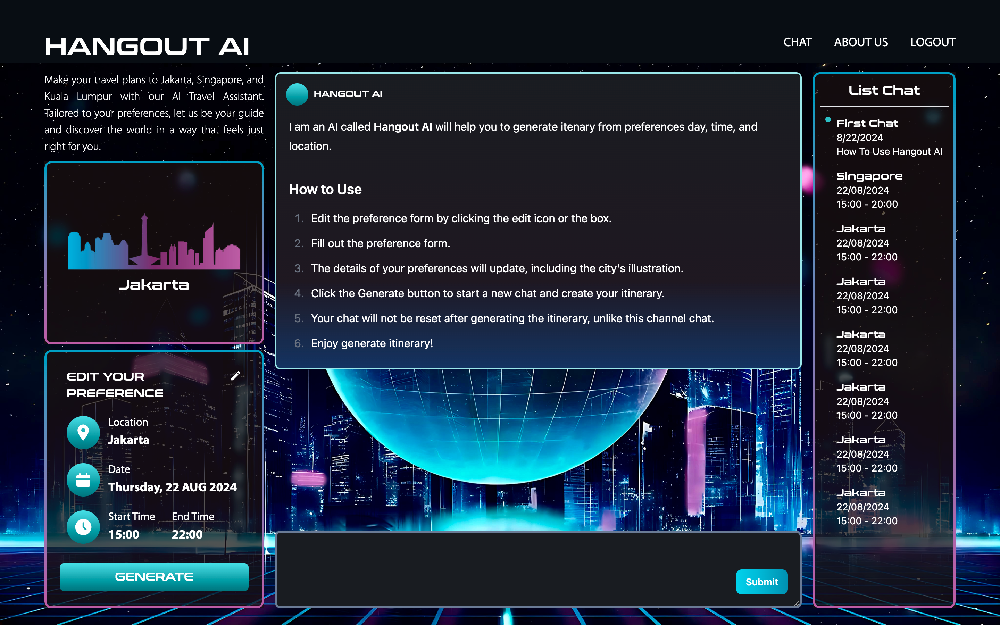
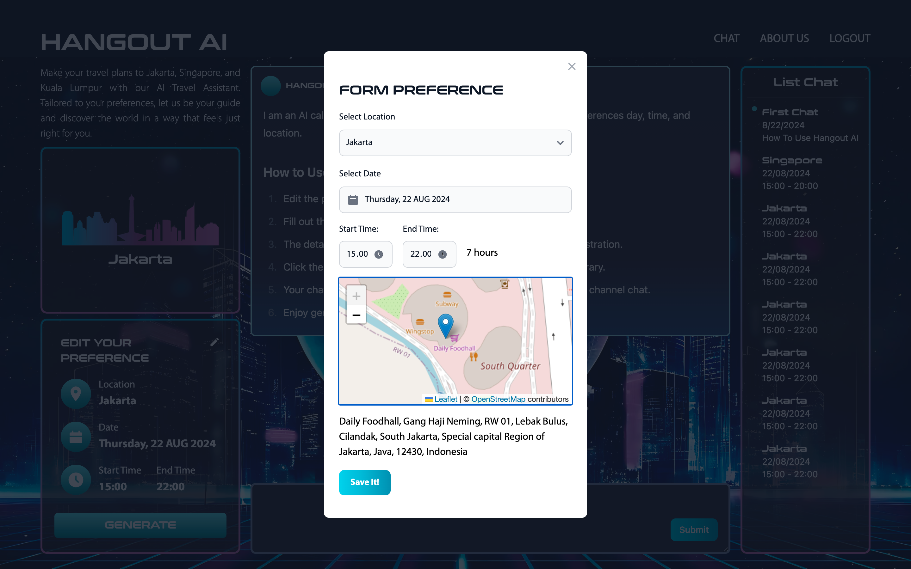
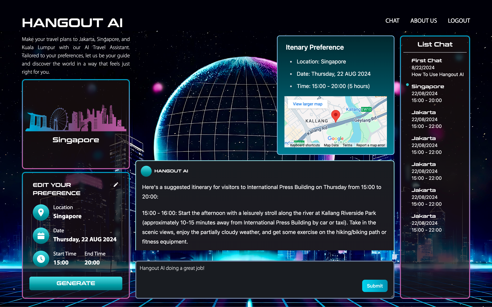
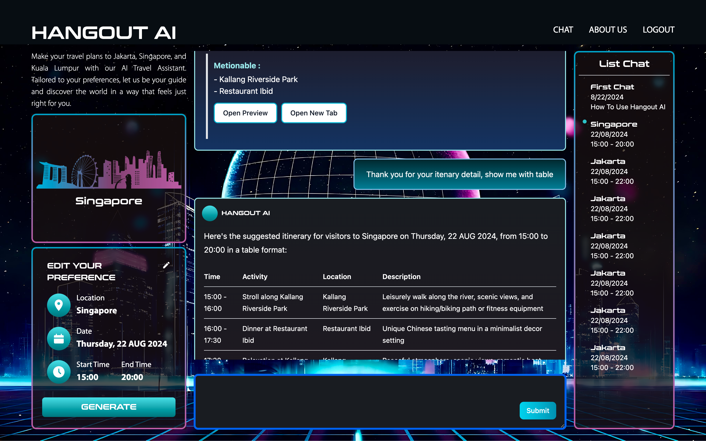

# Hangout AI 


Hangout AI uses a Large Language Model (LLM) to create custom travel itineraries based on user input such as location, date, and weather conditions. The project integrates several software components to deliver a comprehensive and dynamic itinerary generation service.

Our target audience is the general public, including travelers, tourists, and adventure seekers who want a personalized and seamless travel planning experience.

[Explore Hangout AI](https://hangout-ai.vercel.app)

## Table of Contents

- [Overview](#overview)
- [Folder Structure](#folder-structure)
- [Tech Stack](#tech-stack)
- [Architecture](#architecture)
- [TiDB Utilization Overview](#tidb-utilization-overview)
- [Setup](#setup)
  - [Prerequisites](#prerequisites)
  - [Installation](#installation)
- [Usage](#usage)
  - [Running the LLM](#running-the-llm)
  - [Running the Server](#running-the-server)
  - [Running the Client](#running-the-client)
- [Hangout AI Application](#hangout-ai-application)
- [Contribution](#contribution)
- [License](#license)

---


## Overview
This repository contains three main components for the Hangout AI project, which is designed to generate personalized travel itineraries for users. The components are divided into three folders: `llm`, `server`, and `client`.


## Folder Structure

- **llm**: Contains the code for the Large Language Model (LLM) that generates itineraries.
- **server**: Hosts the FastAPI and Node.js servers, managing user requests, authentication, and LLM integration.
- **client**: The front-end application built with React, where users interact with the AI to generate their travel itineraries.

## Tech Stack


- **LLM**: Groqcloud Llama3-70B-8192
- **Indexing & Retrieval**: LlamaIndex
- **API Framework**: FastAPI (Python), Node.js
- **Data Scrapping**: Golang, Google maps scraper
- **Data Cleaning**: Python, Pandas
- **Database**: TiDB (Vector DB) & All the data (user, chat, location) on TiDB
- **Frontend**: React, Vite, Tailwind CSS
- **Embeddings**: Gemini models/embedding-001
- **External APIs**: Google Maps, Visual Crossing (Weather API)
- **Client** : React JS, Tailwind CSS, React Markdown
- **Authentication** : OAuth 0.2 Google APIs and JWT 
- **Deployment** : Vercel, Heroku, Personal VPS
- **Web Analytic** : Firebase Google Analytic


## Architecture

The project is built using a microservices architecture, with each component independently handling specific tasks:

1. **LLM Service** (`llm` folder): Generates itineraries using the Groq Llama3-70B-8192 model.
2. **API Server** (`server` folder): Handles user requests, authenticates via Google OAuth, and interacts with the LLM and database.
3. **Client Application** (`client` folder): A React-based front-end where users can generate and interact with their itineraries.

## TiDB Utilization Overview
 - [Using RAG with PingCAP Vector MySQL Database](#using-rag-with-pingcap-vector-mysql-database)
 - [Using TiDB Serverless for MetaLocations](#using-tidb-serverless-for-metalocations)
 - [Using MySQL Database from TiDB](#using-mysql-database-from-tidb)

### Using RAG with PingCAP Vector MySQL Database

**RAG (Retrieval-Augmented Generation)** is a technique where a model retrieves relevant data from a database or knowledge base to enhance the quality and relevance of generated outputs. In the context of **Hangout AI**, we use RAG with the **PingCAP Vector MySQL Database** to efficiently process and retrieve location-based information that improves the accuracy and personalization of travel itineraries.

#### Key Steps:
1. **Data Embedding**: 
   - Location data (e.g., descriptions, reviews, metadata) is embedded into vector representations using models like the **Gemini embedding model**.
   - These vectors are stored in the PingCAP Vector MySQL Database for efficient similarity searches.

2. **Retrieval Process**:
   - When a user requests an itinerary, relevant location data is retrieved by performing similarity searches in the vector database.
   - This data is then fed into the Large Language Model (LLM), enhancing the contextual understanding and output relevance.

3. **Itinerary Generation**:
   - The retrieved data enriches the LLM's prompts, leading to more accurate and tailored itineraries based on user preferences, current weather, and other dynamic factors.

By leveraging RAG with PingCAP Vector MySQL Database, **Hangout AI** can generate more informed and contextually appropriate itineraries, ensuring that users receive recommendations that are both personalized and relevant.

### Using TiDB Serverless for MetaLocations

**TiDB Serverless** is used in **Hangout AI** to manage and retrieve **MetaLocations** data, which is not sensitive and is utilized for visual itinerary previews integrated with Google Maps and Google Reviews.

#### Key Features:
1. **Scalable Data Management**:
   - TiDB Serverless efficiently handles large datasets of MetaLocations, ensuring that the service remains responsive even as the volume of data grows.
   - This flexibility allows **Hangout AI** to scale its location database without worrying about underlying infrastructure.

2. **Integration with Google Maps and Reviews**:
   - MetaLocations stored in TiDB Serverless are used to provide visual previews of itinerary locations.
   - The integration with Google Maps enables users to view detailed maps, directions, and nearby attractions.
   - Google Reviews provide additional insights, helping users make informed decisions about their travel plans.

3. **Non-Sensitive Data Handling**:
   - Since MetaLocations data is non-sensitive, it can be freely shared and used for public-facing features without compromising user privacy.
   - This makes TiDB Serverless an ideal solution for managing this type of data, balancing performance with security.

By utilizing TiDB Serverless for MetaLocations, **Hangout AI** ensures that users can preview their itineraries visually and access detailed information about each location, enhancing the overall travel planning experience.


### Using MySQL Database from TiDB
we delve into how TiDB’s MySQL compatibility enhances data management within the Hangout AI project.e efficiently manage user profiles, location information, and chat records using Sequelize. TiDB's scalable nature ensures that as data volumes grow, the system remains performant and responsive, while the MySQL compatibility allows for seamless integration with existing tools and libraries. This setup provides a powerful and flexible solution for handling diverse data types essential for generating personalized travel itineraries.

#### Key Features

- **User Data Management**: 
  - **Purpose**: Efficiently handle user profiles, including personal details and authentication.
  - **Schema**: Includes fields such as `id`, `name`, `email`, `image`, and timestamps (`createdAt`, `updatedAt`).

- **Location Data Management**:
  - **Purpose**: Manage and store information about various travel locations.
  - **Schema**: Includes fields like `id`, `title`, `address`, `latitude`, `longitude`, and additional metadata.

- **Chat Data Management**:
  - **Purpose**: Store interactions between users and the AI, including messages and metadata.
  - **Schema**: Includes fields such as `id`, `name`, `messages`, `address`, `latitude`, `longitude`, and user associations.

- **MySQL Compatibility**:
  - **Advantage**: Utilize TiDB’s MySQL protocol support to seamlessly integrate with Sequelize for data management.

- **Scalability**:
  - **Benefit**: TiDB’s distributed nature ensures scalability and efficiency in handling large volumes of data.


## Setup

### Prerequisites

- Python 3.8+
- Node.js 14+
- Virtual environment tool (e.g., `venv` or `conda`)
- TiDB instance
- API keys for Groq, Google Maps, and other external services

### Installation

1. **Clone the repository**:
   ```bash
   git clone https://github.com/yourusername/hangout-ai.git
   cd hangout-ai
   # read the README.md
   ```


2. **Set up the LLM**:
   - Navigate to the `llm` directory and install Python dependencies:
     ```bash
     cd llm
     python -m venv venv
     source venv/bin/activate  # On Windows, use `venv\Scripts\activate`
     pip install -r requirements.txt
     # read the README.md & create the .env
     ```

3. **Set up the Server**:
   - Navigate to the `server` directory and install Node.js dependencies:
     ```bash
     cd ../server
     npm install
     # read the README.md & create the .env & config.json
     ```

4. **Set up the Client**:
   - Navigate to the `client` directory and install Node.js dependencies:
     ```bash
     cd ../client
     npm install
     # read the README.md & create the .env
     ```

5. **Set up environment variables**:
   - Create a `.env` file in each of the `llm`, `server`, and `client` directories using the provided templates.

## Usage

### Running the LLM

To start the LLM service:
```bash
cd llm
python main.py
```

### Running the Server

To start the FastAPI and Node.js servers:
```bash
cd server
npm run start
```

### Running the Client

To start the client application:
```bash
cd client
npm run dev
```

## Hangout AI Application 
Hangout AI is a web application that can be opened in a browser. It is designed to be responsive for both desktop and mobile devices

1. Landing Page 

> Users need to log in with the Google Sign-In option that we provide.  
> Note : We will change the YouTube link after we finish recording.

2. Chat Page 


> We set the default location to Jakarta, but if the user changes it to Singapore or Kuala Lumpur, the city illustration will change as well.
<br/>
<br/>





> Users can continue chatting with the AI, for example, by asking for a table. We have a preview button to show an image of the mentioned location or open a new tab to view the location on Google for more details and reviews.
<br/>
<br/>


## Contribution

Hangout AI Developer : 
- Ayu Sudi Dwijayanti 
  - [LinkedIn](https://www.linkedin.com/in/ayusudi/)
  - [Devpost](https://devpost.com/ayusudi)
  - [Github](https://github.com/ayusudi)
- Muhammad Luthfi Arifin
  - [LinkedIn](https://www.linkedin.com/in/luthfiarifin/)
  - [Devpost](https://devpost.com/luthfiarifin)
  - [Github](https://github.com/luthfiarifin)

Feel free to open an issue or submit a pull request if you'd like to contribute to this project.


## License

This project is licensed under the MIT License. See the [LICENSE](./LICENSE) file for more details.
